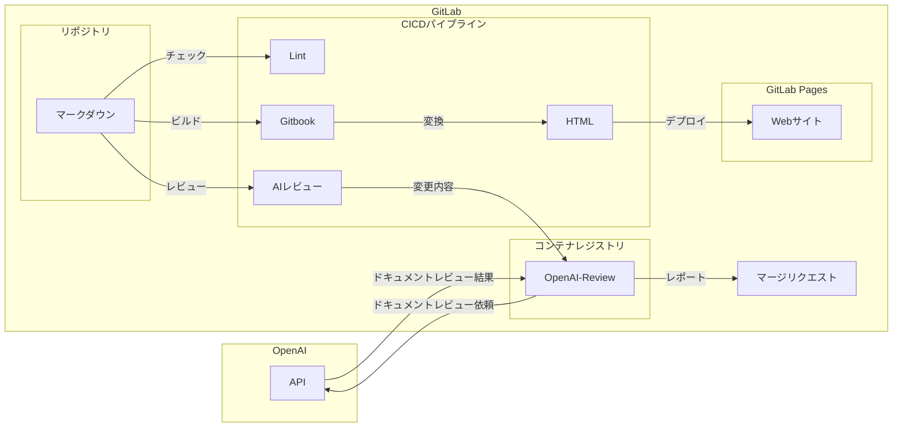
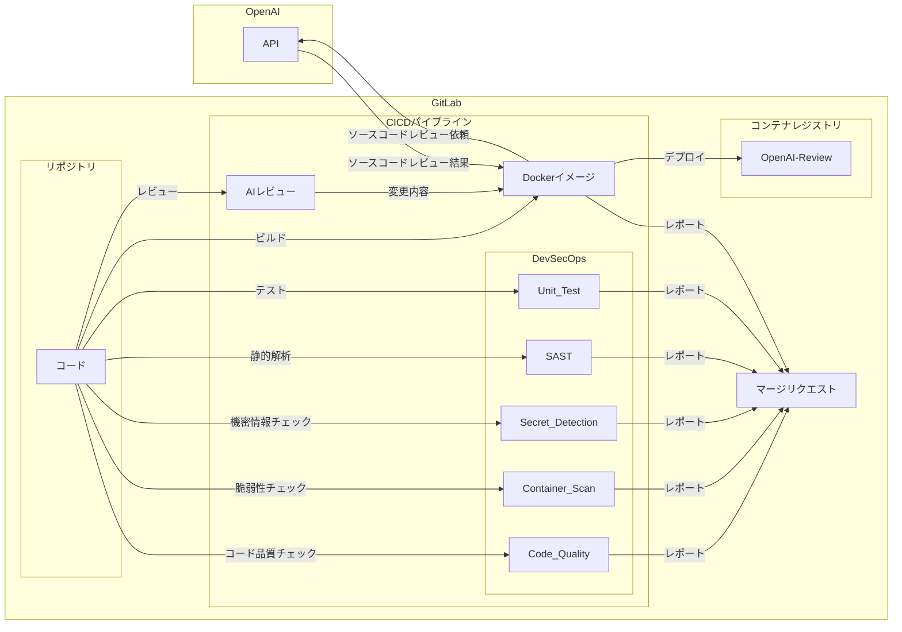

# GitLabで実現するDevSecOpsとAI連携

## 概要

本リポジトリにコミットされたマークダウンファイルは、CI/CDパイプラインでLint、AIレビューを経てWebサイトに自動デプロイされる。

## 目的

- GitLabを用いたDevSecOpsの実装デモ
- GitLabで実現するDevSecOpsの説明
- Documentation as Codeの実装デモ
- 開発プロセスへのAI自動レビュー組込みデモ

## 全体処理イメージ

### Docs

- [リポジトリ](https://gitlab.com/taku-miyanaga/docs)
- [パイプライン](https://gitlab.com/taku-miyanaga/docs/-/pipelines/1061807587)
- [マージリクエスト](https://gitlab.com/taku-miyanaga/docs/-/merge_requests/1)

### OpenAI-Review

- [リポジトリ](https://gitlab.com/taku-miyanaga/openai-review)
- [パイプライン](https://gitlab.com/taku-miyanaga/openai-review/-/pipelines/1057805396)
- [マージリクエスト](https://gitlab.com/taku-miyanaga/openai-review/-/merge_requests/1)
