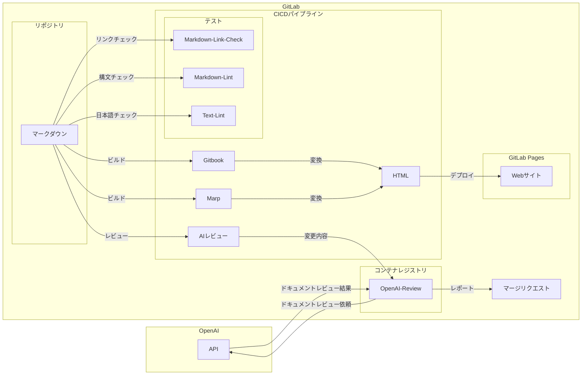
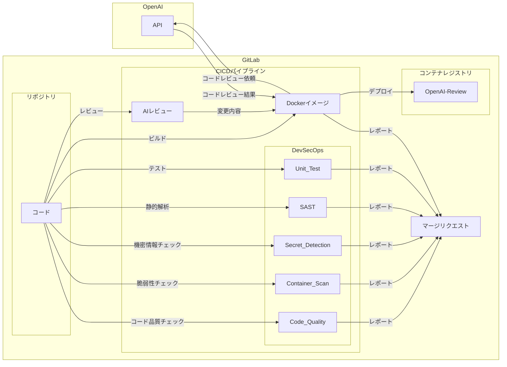

# GitLabで実現するDevSecOpsとAI連携

## 概要

GitLabを使用してDevSecOpsを実現し、AIレビューを開発プロセスに組み込む簡易実装。

本リポジトリにコミットされたマークダウンファイルを、CI/CDパイプラインを通じてLint（構文チェック）、AIレビューを行い、最終的にWebサイトへ自動デプロイする。

## 目的

本リポジトリの実装と実行結果を通じて以下の効果を示す。

### DevSecOps

DevSecOpsは、開発（Dev）、セキュリティ（Sec）、および運用（Ops）の統合を目指しており、開発ライフサイクル全体にわたってセキュリティを確保することに焦点を当てている。コードのコミット時からデプロイまで、継続的なセキュリティチェックと品質保証を行うことが可能になる。

### Docs as Code

ドキュメントをコードと同様に扱うアプローチ。このアプローチでは、ドキュメントはバージョン管理され、レビュープロセスが適用される。これにより、ドキュメントの品質が向上し、チーム間での情報共有が容易となる。CI/CDパイプラインを活用することで、ドキュメントの自動ビルド、テスト、デプロイを実現する。

### GitLabで実現するDevSecOpsの説明

上記Docs as Codeのアプローチによって生成したドキュメントをWebページとして公開する。

### 開発プロセスへのAIレビュー組込み

リポジトリとOpenAIをCI/CDパイプラインを通じて連携し、開発プロセスの自動化と効率化を促進する。AIを活用することで、コードレビュー、ドキュメントのチェック、セキュリティ評価などを自動化し、より速く、より正確に行うことができる。

## アーキテクチャ

### Docs

- [リポジトリ](https://gitlab.com/taku-miyanaga/docs)
- [パイプライン](https://gitlab.com/taku-miyanaga/docs/-/pipelines/1061807587)
- [マージリクエスト](https://gitlab.com/taku-miyanaga/docs/-/merge_requests/1)

### OpenAI-Review

- [リポジトリ](https://gitlab.com/taku-miyanaga/openai-review)
- [パイプライン](https://gitlab.com/taku-miyanaga/openai-review/-/pipelines/1061803197)
- [マージリクエスト](https://gitlab.com/taku-miyanaga/openai-review/-/merge_requests/1)
