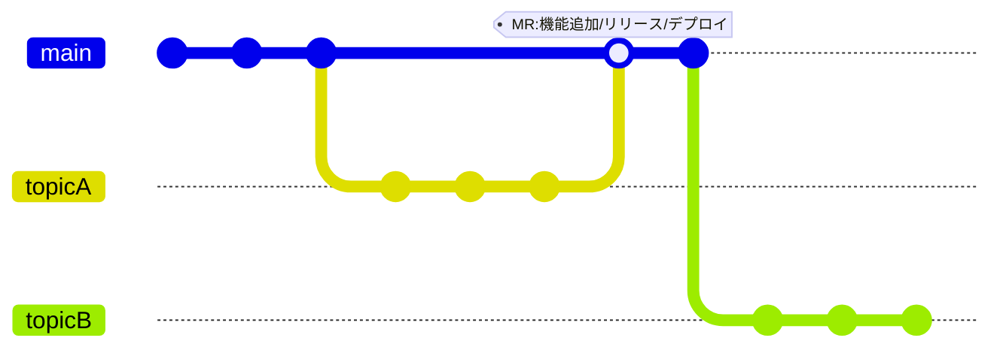
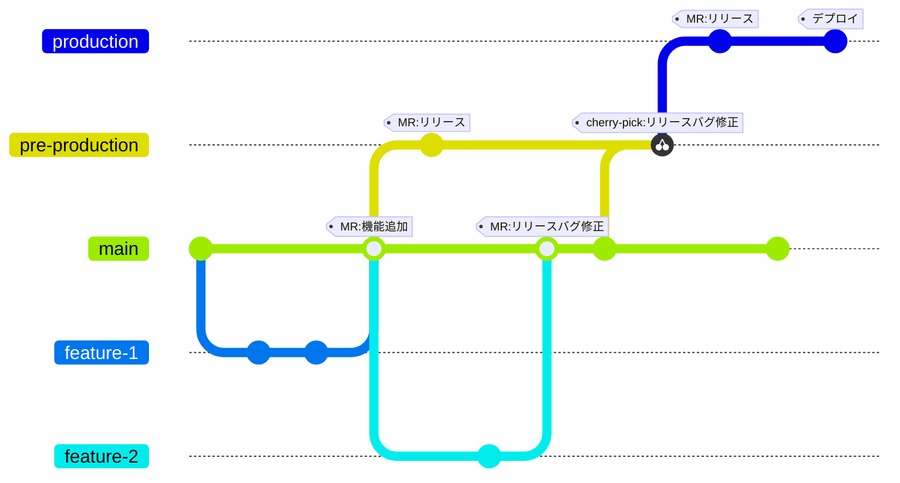
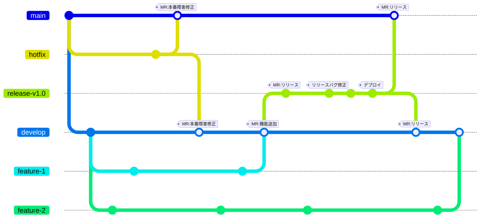

# gitGraphの描画用

gitbook-cliがMermaid8.x以降に対応していないため、クライアント側で描画して画像として利用

## GitHub Flow

```mermaid
%%{init: { 'gitGraph': { 'showCommitLabel': false } } }%%
gitGraph
    commit
    commit
    commit
    branch topicA
    checkout topicA
    commit
    commit
    commit
    checkout main
    merge topicA tag: "MR:機能追加/リリース/デプロイ"
    commit
    branch topicB
    checkout topicB
    commit
    commit
    commit
```

## GitLab Flow

```mermaid
%%{init: { 'gitGraph': { 'showCommitLabel': false,'mainBranchOrder': 3} } }%%
gitGraph
    commit
    branch feature-1 order:4
    checkout feature-1
    commit id:"機能追加"
    commit id:"テスト障害対応"
    checkout main
    merge feature-1 tag: "MR:機能追加"
    branch pre-production order:2
    checkout pre-production
    commit tag: "MR:リリース"
    checkout main
    branch feature-2 order:5
    checkout feature-2
    commit
    checkout main
    merge feature-2 tag: "MR:リリースバグ修正"
    commit id:"リリースバグ修正"
    checkout pre-production
    cherry-pick id:"リリースバグ修正"
    branch production order:1
    checkout production
    commit tag: "MR:リリース"
    checkout main
    commit
    checkout production
    commit tag: "デプロイ"
```

## Git Flow

```mermaid
%%{init: { 'gitGraph': { 'showCommitLabel': false} } }%%
gitGraph
    commit
    branch hotfix order: 1
    branch develop order: 3
    commit
    branch feature-1 order: 4
    branch feature-2 order: 5
    commit
    checkout develop
    checkout feature-1
    commit
    checkout hotfix
    commit
    checkout main
    merge hotfix tag: "MR:本番障害修正"
    checkout develop
    merge hotfix tag: "MR:本番障害修正"
    checkout feature-2
    commit
    checkout feature-1
    commit
    checkout develop
    merge feature-1 tag: "MR:機能追加"
    branch release-v1.0 order: 2
    commit tag: "MR:リリース"
    checkout feature-2
    commit
    checkout release-v1.0
    commit tag: "リリースバグ修正"
    commit
    commit tag: "デプロイ"
    checkout main
    merge release-v1.0 tag: "MR:リリース"
    checkout develop
    merge release-v1.0 tag: "MR:リリース"
    checkout feature-2
    commit
    checkout develop
    merge feature-2
```
