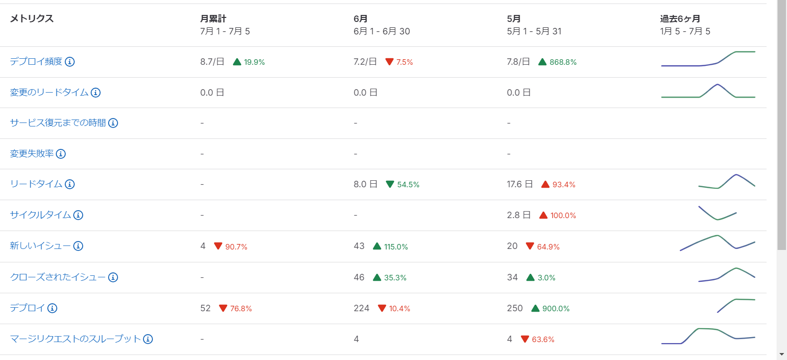
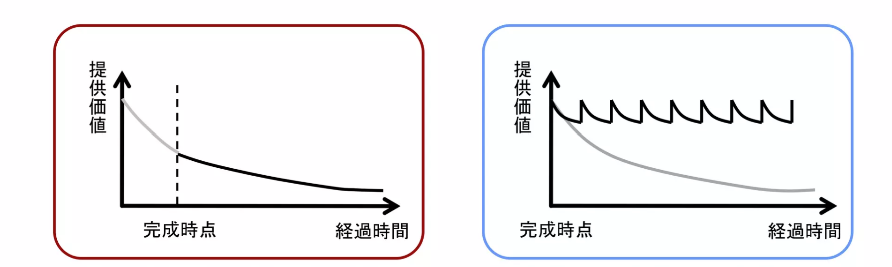
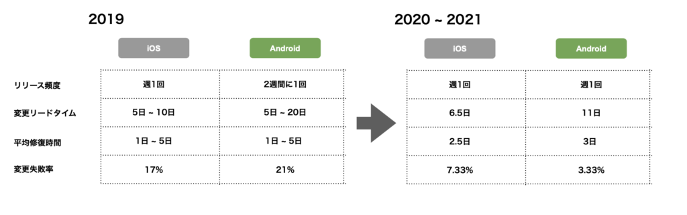
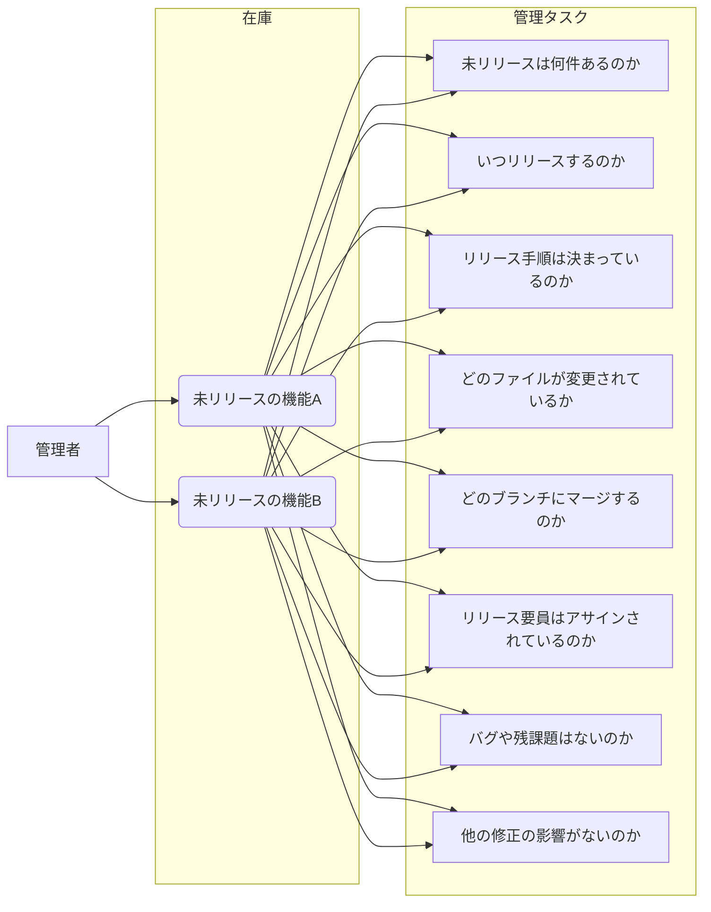
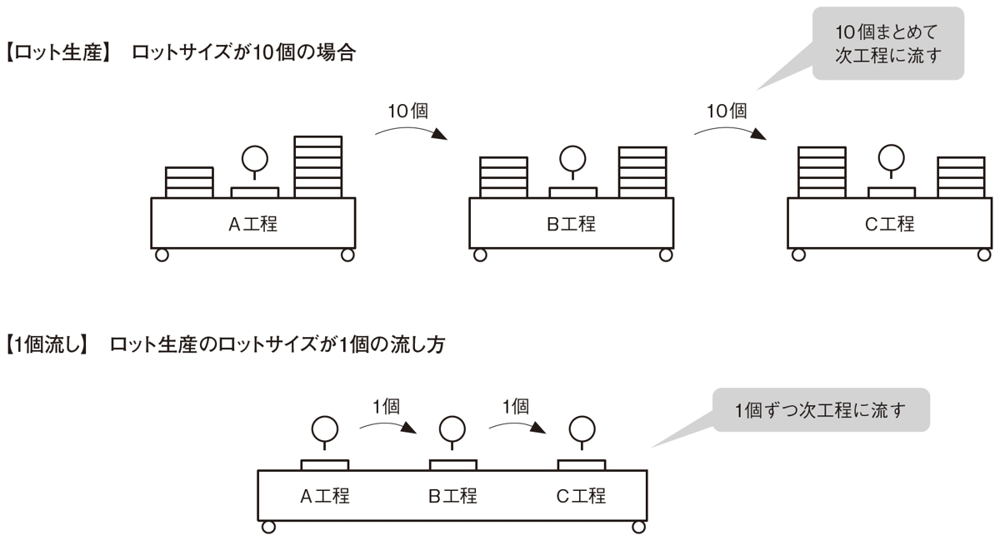
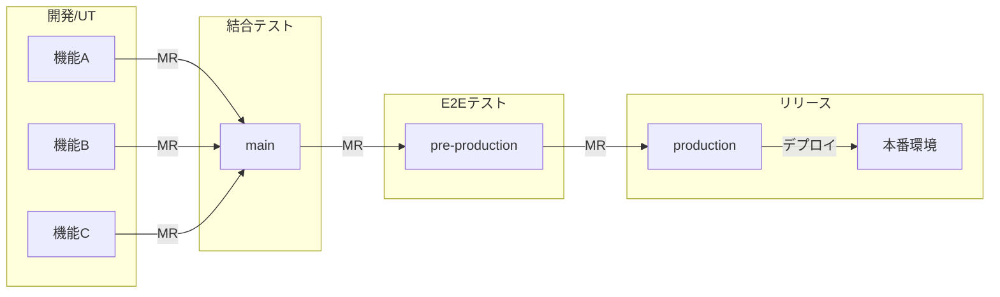
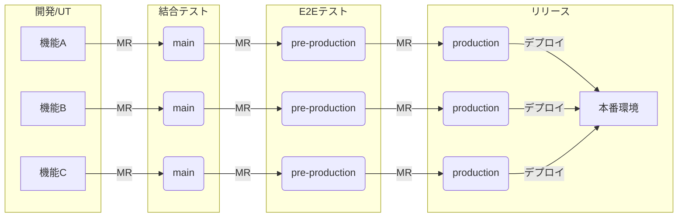
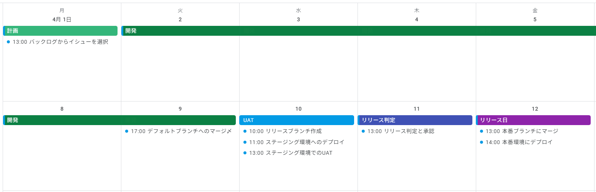
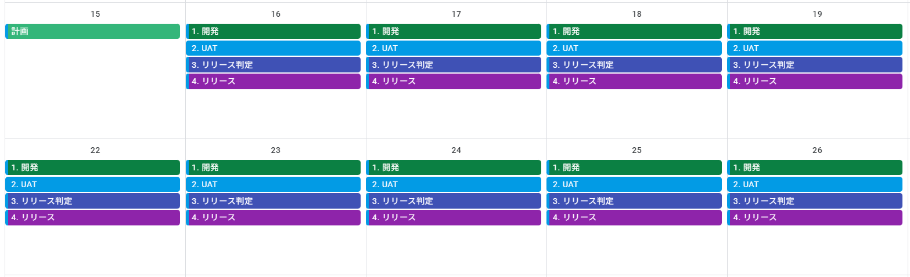

<!-- omit in toc -->
# チームのDevOpsレベル評価と改善

## 概要

GitLabを導入した開発をする上で、今チームがどのDevOpsレベルにあるのかを定量的に把握することが改善のスタートとなる。

本稿ではDevOpsレベルの評価方法を紹介し、製造業で広く浸透しているTPS(トヨタ生産方式)を用いDevOpsレベルを改善していくための考え方とGitLabでの実現方法について説明する。

## 目次

- [概要](#概要)
- [目次](#目次)
- [チームのDevOpsレベル評価](#チームのdevopsレベル評価)
- [なぜ迅速なリリースが必要なのか](#なぜ迅速なリリースが必要なのか)
  - [価値の減衰](#価値の減衰)
  - [在庫管理](#在庫管理)
- [迅速にリリースするための考え方](#迅速にリリースするための考え方)
  - [リリースをイベントにしてはならない](#リリースをイベントにしてはならない)
  - [1個流し](#1個流し)
- [GitLab での実現方法](#gitlab-での実現方法)
  - [GitLab での自働化](#gitlab-での自働化)
  - [GitLabでの1個流し](#gitlabでの1個流し)
  - [その他考慮事項](#その他考慮事項)
  - [ロードマップ](#ロードマップ)
  - [2wのスプリント計画例](#2wのスプリント計画例)
- [まとめ](#まとめ)
- [参考リンク](#参考リンク)

## チームのDevOpsレベル評価

チームのDevOpsレベルを評価するため、GoogleのDevOpsResearch and Assessment（DORA）が提唱する以下4つの評価指標(Four Keys)が用いられる。

- リリース頻度 - 本番環境へのリリースの頻度
- 変更リードタイム - commit から本番環境稼働までの所要時間
- サービス復元時間 - チームが本番環境での障害からリカバリするのにかかる時間
- 変更障害率 - デプロイが原因で本番障害が発生する割合（％）

各指標により、チームのDevOpsレベルは以下の4段階で判定される。

|                  |      Elite      |            High            |         Medium          |       Low       |
| ---------------- | --------------- | -------------------------- | ----------------------- | --------------- |
| リリース頻度     | 1 日に 1 回以上 | 1 週間～ 1 ヶ月に 1 回以上 | 1 ヶ月～半年に 1 回以上 | 半年に 1 回未満 |
| 変更リードタイム | 1 時間以内      | 1 週間以内                 | 1 ヶ月～半年以内        | 半年以上        |
| サービス復元時間 | 1 時間以内      | 1 日以内                   | 1 日～ 1 週間以内       | 半年以上        |
| 変更障害率       | 0-15％          | 16-30％                    | 16-30％                 | 16-30％         |

※出典 [エリートDevOpsチームであることをFour Keysプロジェクトで確認する](https://cloud.google.com/blog/ja/products/gcp/using-the-four-keys-to-measure-your-devops-performance)

GitLabではバリューストリームで自チームのFour Keysを確認できる。改善は計測から始まると言われるように、まず現状のFour Keysを把握し、チームの目標レベルを設定する。

## なぜ迅速なリリースが必要なのか

Four Keysは、リードタイムとデプロイ頻度といったリリース速度関連の指標に焦点を当てている。迅速なリリースが必要な理由2点を以下に述べる。

### 価値の減衰

ウォーターフォール開発では、リリース後のソフトウェアは一定の価値を提供し続けると考えられてきた。しかし、現在ではソフトウェアも経過時間によって価値が減衰し、要求からリリースまでの時間長期化はソフトウェアのトータル価値を損ねると考えられる。

サービスの価値を維持するためには短期間のリリースを繰り返す必要があり、実際にメルカリや ABEMA は1週間に1回アプリを定期リリースしていることが知られている。因みに Amazon は1秒に1回(年間5000万回)ペースでリリースしている。

#### ABEMAのDORAメトリクス

※出典 [ABEMAモバイルアプリ開発のDevOps戦略](https://developers.cyberagent.co.jp/blog/archives/35628/)

### 在庫管理

リリースされていないソースコードは在庫である。在庫は何の価値も生まず、コストだけが発生し続ける。

在庫の弊害は、改善を重ねてきた製造業の例として TPS(トヨタ生産方式)での説明が詳しい。投資して製造した製品の在庫は一般に「資産」と考えられるが、TPS では在庫は価値を生まず管理タスクのみが発生し続ける「ムダ」と定義される。

以下に「ムダ」と定義される理由を述べる。

- 在庫の保持コスト：在庫を保持するにはコストがかかる。製品はストレージスペースを必要とし、そのスペースのレンタルやメンテナンス、さらには在庫管理に必要な人件費など、コストが発生する。
- キャッシュフロー：在庫を多く持つことは、その製品が売れるまで資金が固定されてしまうことを意味する。このため、キャッシュフローに影響を及ぼす。
- 需給の変化への対応：次の新しい製品を生産する前に既存在庫の消化しなければならない。在庫が多いと市場の需給変動に対する対応が遅れる。

ソフトウェア開発では物理的な在庫スペースは発生しないが、リリースまで以下のような管理タスクが発生する。結果、リリースすればバリューとなるソースコードが、在庫のままではコストとしてマイナスのバリューを生み続けることになる。

効率的な生産をするためには、未リリースの機能(在庫)を最小化することが必要となる。

## 迅速にリリースするための考え方

迅速にリリースするために必要な考え方2点を以下に述べる。

### リリースをイベントにしてはならない

DevOpsではリリースは特別なイベントではなく日常的なルーチンワークとして、開発と運用のDevOpsサイクル内の連続したプロセスの一部でなければならない。イシューへのコメントやソースコードのコミットと同じくスムーズにリリースすることが求められる。もし、現状リリースがリスクのあるイベントとなってしまっている場合は、誰にでも反復可能で信頼できるリリースプロセスを作り込まなければならない。

リリースをイベントにしてはならない理由を以下に述べる。

- リスクの低減：リリースが頻繁に行われる場合、各リリースに含まれる変更は比較的小さいため、問題が発生した場合でも影響を制御しやすくなる。
- 価値提供：新機能や改善を迅速にリリースすることで、今の市場ニーズに沿った価値を提供できる。
- 機能の陳腐化回避 : 長期スパンでの開発では失敗が許容できなくなるため、類似の前例があり確実性の高い機能追加に偏りやすい。リリースを頻繁に行えば陳腐化されていない実験的な機能が試行できる。
- フィードバック：新しい機能や修正を迅速にリリースすることで、顧客からのフィードバックを早く得ることができる。
- 作業の効率化：リリースプロセスが日常化されると、そのプロセス自体も効率化され、時間とリソースの節約につながる。

### 1個流し

工場ラインを例に挙げると、TPS では製品生産の流れを管理する方式としてロット生産と 1 個流しの 2 つの主要な方式を定義している。

- ロット生産

ロット生産は一定数量の部品を一括して次の工程に送る方式。部品は同じ工程を同時に通過し、ロットで次の工程に移される。ロット生産は大量生産に適しているが、ロット全体が完成するまで次の工程に進むことができないため、製品のリードタイムが長くなり、在庫が増える。

- 1個流し

1個流しは製造プロセスにおいて、部品を1つずつ次の工程に送り出す方式。1つの部品が工程を通過するまで次の部品を送り込まないという考え方で、これにより無駄が減少し、品質が向上する。また、製品のリードタイムが短縮でき、必要な在庫を最小限に抑えられる。

以下に両方式のリードタイム計算の簡単な具体例を引用する。

> 各工程の 1 個当たりの作業時間を 2 分、1 ロットを 10 個とし、各工程が同時に作業可能な状態になるとします。A 工程が作業を始めても、それが終わらないと B 工程は作業に着手できませんから、ロット生産では A 工程の作業にかかる 20 分（2 分 ×10 個）の間、B 工程は手待ちになります。C 工程の作業者は、2 工程分の 40 分が待ち時間になってしまいます。
> これに対して 1 個流しでは、B 工程での待ち時間は 2 分、C 工程は 4 分に過ぎません。以上より 1 個流しの方が生産能力も生産期間も優れています。
> この他にも図 3 からも分かるように、工程内にある仕掛品在庫は 1 個流しの方が少なくなります。在庫が少ないと、在庫を置くスペースも、在庫数を管理する手間も少なくなるという、付帯的な効果も得られます。

※引用 [生産方式による管理の違いとラインへの流し方](https://xtech.nikkei.com/atcl/nxt/column/18/01309/00047/?P=2)

ソフトウェア開発においても、多くの場合バージョンというロットでリリースを実施している。ロットで各工程を回し、最初の機能が最後の機能の完成を待つことは在庫(未リリースのコード)の拡大を招き、複数機能の同時テストはエラー原因の複雑化を意味している。一方、1個流しは多品種少量の生産に向いているとされ、原則同じコードを再生産することがないソフトウェア開発にも適している。作成した機能から 1 個流しで順次リリースしていくことができれば、在庫は最小化され、迅速なリリースとエラーの原因の特定が容易となる。

また、ソフトウェア開発の生産性を測るCOCOMOで知られるように開発規模が大きくなれば単位あたりの生産性が下がるため、1つひとつの開発規模を小さく保つ1個流しには生産性の面でもメリットがある。

## GitLab での実現方法

GitLab でDevOpsのレベルを上げるためには、CICD パイプラインによる自働化と 1 個流しを実施する。

### GitLab での自働化

迅速にリリースするためには以下 3 つの自働化されたジョブが必要となる。

- 自働デプロイ： 日々のデプロイ作業を自働化し、開発リソースの削減と人の手によるミスをなくす。
- 自働テスト： デプロイ時の回帰テストを自働化し、品質を担保する。開発工程の完了を自働テストをパスすることに定義すれば、属人化を排除し、自工程完結を実現できる。
- 自働セキュリティチェック： ソースコードとライブラリの脆弱性をチェックし、本番環境でのリスクを低減する。

パイプラインは、エラーが発生した場合や異常があれば次工程には進まず、ジョブが停止するように構築しなければならない。

### GitLabでの1個流し

上述の生産方式を GitLab に当てはめると、それぞれ以下のフローとなる。

#### ロット生産（GitLab）

#### 1個流し（GitLab）

原則は製造業の例と同じで、1 個流しでは在庫が発生せず迅速なリリースを実施できる。ただし、1 個流しでは結合テスト、E2E テスト、デプロイの回数が機能数倍(例の図では 3 倍)になるため、実現には自働テスト、自働デプロイのパイプライン導入が前提となる。

### その他考慮事項

テストや CICD とは別の理由で迅速なデプロイできないこともある。

まず、システムがモノリシックになってしまい小さな修正であっても他チームとの調整や承認が必要になっている場合は、調整コストとリードタイムが積み上がり、迅速なリリースは望めない。各機能間を可能な限り疎結合に保ちチームは自身の判断で任意のタイミングでデプロイや切り戻しを行えなければならない。

次に権限の課題がある。レビューOKであっても現場の開発リーダーに本番環境へのリリース可否の権限が与えられているとは限らない。ユーザ部門と開発担当者、もしくは発注者とベンダーのような開発体制の場合、リリース可否の権限が開発側ではなくユーザ部門、もしく発注者にあることが多い。開発側にリリース可否の権限がなければ、追加の承認プロセスが必要がとなるためマージリクエストの承認で直接本番環境へのリリースを実施する事は難しい。原則、実際に手を動かす担当者と承認者の距離が離れれば離れるほど、リリースは遅くなる。

技術面とは別に体制や権限について整理し、例えば小さなリリースであれば現場判断で実施できるように権限を委譲することも検討する。大きなリリースの場合だけユーザ部門や発注側の承認が必要という形でユースケースごとの承認フローを整理する必要がある。

最後にDevOpsでは本番障害が発生する前提で指標に「サービス復元時間」「変更障害率」が含まれている。障害解決するまでの時間を指標に含めている点が特徴的で、サービス復元時間の短縮は本番障害の発生時に切り戻し手順が確立していることがキーとなる。

### ロードマップ

迅速なリリースを段階的に実現していくには、以下のロードマップで進める。

1. 上述の内容とプロダクトの特性を踏まえてどのレベルのDevOpsを目指すのか方針を策定する。
2. 自働ビルド、テスト、デプロイのCICDパイプラインを構築する。
3. 定期リリース日を決める。案件ベースで可変のリリース日を決めていると迅速なリリースは進められない。
4. 定期リリース日から遡りでスプリント計画を建てる。案件ごとの特性は考慮せず、リリース日の何日前に何を実施するかをスケジューリングすれば、自ずとスプリント計画のテンプレートとなる。
5. スプリント計画にバックログを割当て、定期リリース運用を試行する。
6. スプリント完了後にスプリント計画とCICDパイプラインを見直す。
7. 定期リリースの運用が回りはじめたら、Four Keysの計測結果を基に当初方針のレベルまで徐々にロットを小さく、スプリント期間を短くしていく。

### 2wのスプリント計画例

#### HighレベルのDevOpsスプリント

リリース日から遡りで定型アクションの実施日時を決定する。

|   工程   |           アクション           |     納期      |
| -------- | ------------------------------ | ------------- |
| リリース | 本番環境にデプロイ             | N(リリース日) |
|          | 本番ブランチにマージ           | N             |
|          | リリース判定と承認             | N-1           |
| UAT      | ステージング環境でのUAT        | N-2           |
|          | ステージング環境へのデプロイ   | N-2           |
|          | リリースブランチ作成           | N-2           |
| 開発     | デフォルトブランチへのマージ〆 | N-3           |
| 計画     | バックログからイシューを選択   | N-9           |

テンプレートをスケジュール化すると以下になる。先に定型アクションをプロットし、後から案件の個別内容を当て嵌めていく。

#### EliteレベルのDevOpsスプリント

理想的な1個流しではリリース日がなくなり、スプリントは以下のように管理上のタスクの区切りとなる。

## まとめ

まず、迅速なリリースに価値があることを組織やチームの方針として全員で共有することがDevOpsのスタートとなる。その上で迅速なリリースを進めるには、まず短時間で反復可能なリリースプロセスの作り込み、つまりGitLab上にパイプラインを実装し、レビュー完了したマージリクエストを自働デプロイすればよい。本番障害を含めて考えた場合、障害範囲を限定するためのマイクロサービス化や現場への適切な権限移譲、サービスの監視など迅速なリリースと障害検知・ロールバックに備えた総合的な開発プロセス構築が必要となる。

開発プロセスが成熟し、スプリントを徐々に短縮した結果、日常的に1個流しの随時デプロイが可能となればリリース日の概念がないEliteレベルのDevOpsチームとなる。ただ、全てのプロダクトがEliteレベルを目指す必要はない(GitLab自身も1ヶ月に1回のリリースしか行っていない)。常に資産が1つとなるWebサイトは比較的迅速なリリースが可能だが、ストア審査がありクライアントへの配布が必要となるアプリのリリースを随時行うのは現実的でない。プロダクトのコンテキストによって、完全な1個流しではなく小さなロットでのリリースという落としどころを探すことも現実的なDevOpsの形となる。

CICDによる自働化は手段に過ぎない。DevOpsの目的は、自働化を通じて速度を上げた開発サイクルの循環でチームが生み出すバリューを最大化することである。

## 参考リンク

- [エリートDevOpsチームであることをFour Keysプロジェクトで確認する](https://cloud.google.com/blog/ja/products/gcp/using-the-four-keys-to-measure-your-devops-performance)
- [Take the DORA DevOps Quick Check](https://dora.dev/quickcheck/)
- [メルカリ・メルペイで行ったリリースサイクルのアップデート](https://engineering.mercari.com/blog/entry/20211210-b5d0a7dc9c/)
- [1週間リリースを支えるAndroid自動テスト運用](https://engineering.mercari.com/blog/entry/20211210-merpay-android-test-automation)
- [年間5000万件のデプロイを可能に--アマゾンの社内システム「Apollo」とは](https://japan.zdnet.com/article/35062263/)
- [ABEMA モバイルアプリ開発のDevOps戦略](https://developers.cyberagent.co.jp/blog/archives/35628/)
- [生産方式による管理の違いとラインへの流し方](https://xtech.nikkei.com/atcl/nxt/column/18/01309/00047/?P=2)
