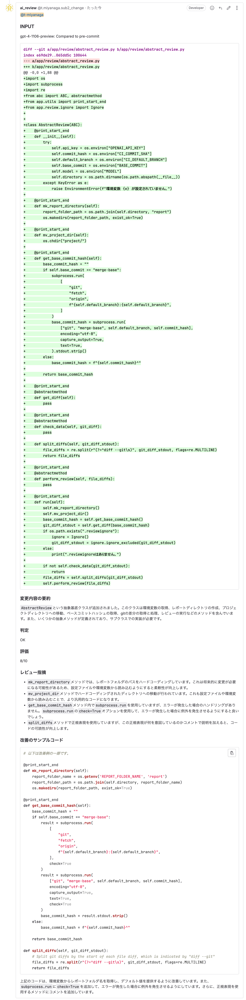
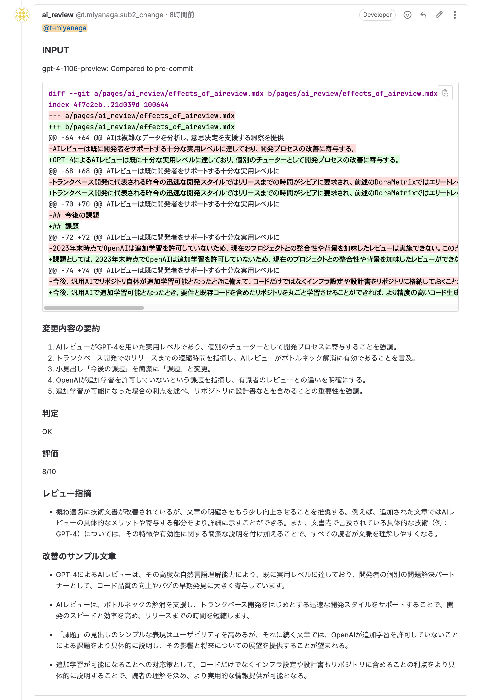

# AIレビューの効果

## 概要

特にソフトウェア開発の分野では、開発者がAIにコード生成やレビューを依頼することが広く行われている。このデモでは、リポジトリの特性（履歴管理）を活用して、変更箇所に対するAIによる自動レビューを実施している。

本稿では、GitLabと連携したAIレビューの実施ステップと効果について述べる。

## 実施ステップ

本リポジトリでは、以下のステップでAIレビューが実施される。

import { Steps } from 'nextra/components'

<Steps>

### 変更コードをリモートリポジトリ(GitLab)にプッシュ

### プッシュをトリガーにCI/CDパイプラインでAIレビューのジョブを自動実行

### GitLabのコンテナレジストリからopenai-reviewイメージをDLし、コンテナを実行

### コンテナ内でコード変更差分を取得し、プロンプトと共にOpenAIのAPIに送信

### OpenAIにてAIレビューを実施

### コンテナ内でレビュー結果を受信し、マージリクエストに結果をポスト

</Steps>

## 実施結果例

### コードレビュー

[AIレビュー例](https://gitlab.com/taku-miyanaga/openai-review/-/merge_requests/1#note_1710772050)

### ドキュメントレビュー

[AIレビュー例](https://gitlab.com/taku-miyanaga/docs/-/merge_requests/1#note_1711747535)

## 効果

### レビューの見える化

プロジェクトメンバー全員が参照可能なマージリクエストにレビュー結果がポストされることにより、レビュー結果がリアルタイムで共有され、コードの修正の経緯がトレース可能となる。結果、レビュー記録は自働管理されるため、レビュー記録表といったエビデンス的な成果物作成は不要となる。

### 修正箇所の差分レビュー

gitで差分抽出するため、修正箇所のみにフォーカスしたレビューが可能となる。対象範囲を絞ることは重複指摘の減少となり、後工程の修正、再レビュー作業が軽減される。

### 品質向上

AIは継続的な品質保証を提供し、ヒューマンエラーのリスクを低減する。これは、ソフトウェアコードのバグ検出や、文書の文法・スタイルのチェックにおいて特に顕著である。

### 効率の向上

AIレビューは一般的なコーディングベストプラクティスに沿って実施される。限られたリソースである有識者レビュー前にコードの品質を担保し、要約の提示により人のレビューの効率を向上させる。

### 一貫性の確保

AIは一定の基準に基づいて判断を行うため、レビューの一貫性が保たれる。人間のレビュアーが持つ主観やバイアスの影響を受けないため、公平かつ均一な評価が期待できる。

### 知識の蓄積と共有

AIは豊富な過去データから学習し、レビューを実施する。このプロセスにより、組織内に存在しなかった知識を獲得し、オープンな場所での投稿を通じて知識の共有が促進される。

### コスト削減

効率化と自動化により、人的リソースの削減や時間コストの節約が可能となる。これは、長期的なコストメリットをもたらす。

## まとめ

GPT-4によるAIレビューは既に十分な実用レベルに達しており、個別のチューターとして開発プロセスの改善に寄与する。

また、開発速度の面でもAIレビューは改善をもたらす。トランクベース開発に代表される昨今の迅速な開発スタイルではリリースまでの時間がシビアに要求され、前述のDoraMetrixではエリートレベルのDevOpsチームではコミットからリリースまでの時間は1時間以内と定められている。

テスト〜リリースが自動化された理想的なパイプラインではコミット後に人の判断が必要なのはレビューのみだが、安定して1時間以内にコードレビューを実施するのは現実的に難しく、ボトルネックとなっている。有識者の判断を必要としないAIレビューはこのボトルネック解消をサポートし、迅速な開発を推進するための有力な手段になる。

## 今後の課題

本実装ではOpenAIのgpt-4-1106-previewモデルを利用したAIレビューを実施している。汎用モデルのため、レビュー指摘は一般的なコーディングのベストプラクティスに留まっており、既存コードとの整合性や背景を加味したレビューが実施できていない。この点で有識者のレビューに及ばないため、現時点では補助機能としての利用になる。

今後、追加学習が可能(2023年末時点でOpenAIは追加学習を許可していない)となったとき、要件やサーバー設定、既存コードを含めたリポジトリ自体を学習させることができれば、より精度の高いコ
ード生成とレビューが可能になる。自力でリポジトリを学習させたモデルを作成するのは難易度が高いため、本実装としては学習が容易になるように開発コードだけではなくインフラ設定や設計書をコード化してリポジトリに格納しておくことで将来のAIサービスアップデートに迅速に対応していくための準備を進める。
