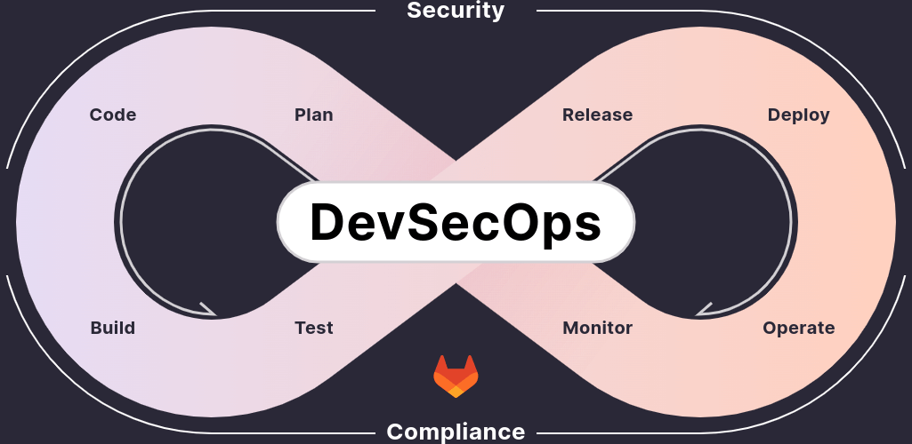

# GitLabでのDevSecOps説明

## 概要

本稿では、DevSecOpsが必要とされるようになった経緯と、GitLabでのDevSecOps実現方法について説明する。

近年、DevOpsに「セキュリティ（Security）」の要素を追加したDevSecOpsが注目されており、GitLabもDevOpsプラットフォームとして、セキュリティ機能の統合に注力している。

## DevSecOpsが必要とされる経緯

従来の開発では、セキュリティ対策は開発の最後の工程、あるいはリリース後にセキュリティ有識者が実施するものであり、開発者はXSSやSQLインジェクションなど代表的な脆弱性を意識すれば必要十分だった。

しかし、OSSを多用した短期間サイクルのモダンな開発では、リリース前のセキュリティ有識者による検証はボトルネックとなるリスクがある。各開発者が実装段階でセキュリティ対策を意識し、開発チーム・運用チームを含めたプロダクトに関わる全員の責任として対応することが求められている。


※出典 [Veracode：クラウド型アプリケーションセキュリティプラットフォーム](https://f2ff.jp/2021/interop/exhibitor/show.php?id=702&lang=ja)

### OSSの深刻な脆弱性の実例

2021年12月、Log4j(Javaで使用されるロギングライブラリ)に重大な脆弱性が発見された。多くのシステムがこのライブラリを使用していたため被害が全世界に広がり、OSSの脆弱性がどれほど深刻な影響をもたらす可能性があるか、多くの企業が認識することとなった。

この深刻な脆弱性Log4jShell(CVE-2021-44228)は、JNDI Lookup機能（ログとして記録された文字列から、一部の文字列を変数として置きかえる機能）を悪用する。ログに書き込まれた特殊な文字列を実行し、第三者がリモートでjava classファイルを読み込んで実行できる。

脆弱性は以下のシンプルなコードで再現できる。

```java
import org.apache.logging.log4j.LogManager;
import org.apache.logging.log4j.Logger;

public class Log4jSample {

  private static final Logger logger = LogManager.getLogger(Log4jSample.class);

    public static void main( String[] args ) {
        // 6u211、7u201、8u191、11.0.1以上のJDKバージョンはデフォルトでfalseなので
        // 今回の脆弱性は起きない
      System.setProperty("com.sun.jndi.ldap.object.trustURLCodebase", "true");
        // JNDIのLookUp機能により、ただの文字列ではなく外部へのアクセスが実行されてしまう
      logger.error("${jndi:ldap://127.0.0.1:1389/Exploit}");
    }
}
```

※出典 [【図解】Apache Log4jの脆弱性の仕組みと対応の必要性、攻撃有無の確認方法（CVE-2021-44228）](https://amg-solution.jp/blog/27313)

logger.errorに`「${jndi:ldap://~}」`という文字列が埋め込むことで攻撃が成立する。指定したLDAPから返却されるパスに攻撃用のjava classファイルを配置すれば対象のWebサーバで任意のコードが実行できる。実際にこのシンプルなコードで再現できる脆弱性を利用して、ユーザ名・パスワード、トークンが流出し、サーバの設定によってはDBからテーブルを丸ごと抜き出すことや他のサーバへの攻撃の踏み台になる。

対策としてApach.orgは緊急パッチをリリースしているため、ライブラリのアップデートによってこの問題は回避できる。しかし、OSSの原則として脆弱性による損害は使用者が責任を負うため、いち早く脆弱性の情報を収集しパッチをあてることが重要となる。

### OSSの多用

上記の脆弱性が潜在的に全てのライブラリに存在する可能性がある。ライブラリのバージョンやソースコードの変更がなくても、明日には新たな脆弱性が明らかになる可能性があり、使用しているOSSのライブラリの数が多ければそのリスクは増加する。

しかし、ツリー構造で参照され、パッケージマネージャーで芋づる式に取得されるライブラリの脆弱性情報を、セキュリティ有識者ではない各開発者が日々追跡するのは事実上困難である。日々の開発する中で現在参照しているバージョンに問題がないのかを把握することすら、かなりの工数が必要となる。


### DevSecOpsの誕生

上記の経緯から、日々更新されるライブラリの脆弱性情報を取得し、開発サイクルの中にセキュリティ対策を組み込むDevSecOpsという概念が生まれた。開発者が実装の早い段階(シフトレフト)でセキュリティ対策する仕組みが必要とされている。



しかし、理想とセキュリティ有識者ではない開発者が独力でセキュリティ問題を発見・解決することの実現にはギャップがある。GitLabは、そのギャップを埋めるために開発者のセキュリティ対策をサポートする仕組みを提供している。


## GitLabでのDevSecOps

Log4jの問題からわかるように、ソースコードをベースとしたセキュリティ対策には大きく2つの側面がある。

- 使用しているライブラリに脆弱性が存在しないか
- 自分たちが実装したコードに脆弱性が存在しないか

前者がDependency ScanやContainer Scanと呼ばれる依存ライブラリのチェックとなり、後者がSASTと呼ばれる静的コード解析になる。


GitLabのSASTやDependency Scanは、日々更新されるライブラリやフレームワークの脆弱性情報を自動で取得し、いち早く脆弱性情報と修正方法を提供する。セキュリティ専門知識と開発者のギャップを提案形式で補い、リポジトリ、CICDと連携しながらオールインワンでシフトレフトのセキュリティ対策を実現するのが、GitLabが提供するDevSecOpsである。


## 参考リンク

[Veracode：クラウド型アプリケーションセキュリティプラットフォーム](https://f2ff.jp/2021/interop/exhibitor/show.php?id=702&lang=ja)

[【図解】Apache Log4jの脆弱性の仕組みと対応の必要性、攻撃有無の確認方法（CVE-2021-44228）](https://amg-solution.jp/blog/27313)
