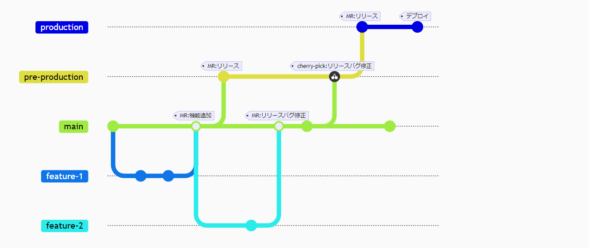
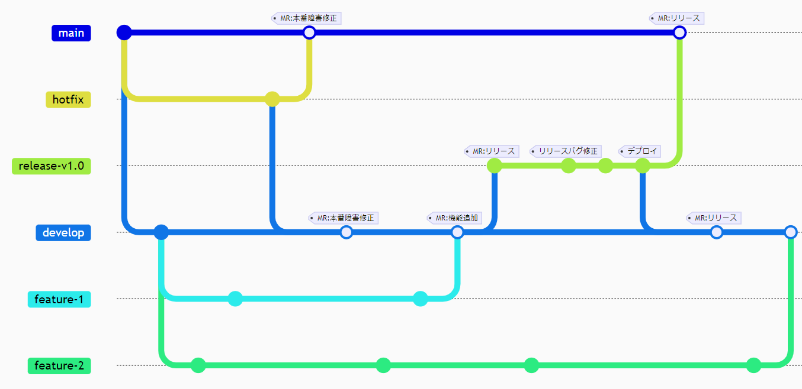

# Gitブランチ戦略

## 概要

Gitのブランチ構成は開発スタイルや規模に応じて、プロダクトごとに使い分けられる。本稿では代表的なGitHub Flow、GitLab Flow、Git Flowの3パターンについて、図を用いてメリットとデメリットを説明する。

## 代表的なブランチ戦略

一般的に以下の3つのブランチ戦略がよく用いられる。それぞれの特性を以下の表に示す。

| ブランチ戦略 | リリース速度 | シンプルな運用 | リリースタイミング制御 | 厳密なバージョン管理 |
| ------------ | :----------: | :------------: | :--------------------: | :------------------: |
| GitHub Flow  |      〇      |       〇       |           ×            |          ×           |
| GitLab Flow  |      △       |       △        |           〇           |          △           |
| Git Flow     |      △       |       ×        |           〇           |          〇          |

特に要求がなければ、最も一般的なGitHub Flowを採用する。環境やリリース管理についてプロジェクトの個別要求がある場合、ベースとなるフローを選択し、カスタマイズして運用する。

## 各フローのメリットとデメリット

### GitHub Flow

リリースタイミングや工程管理しないシンプルなブランチ運用が可能。開発本線の最新版と本番リリース資産が常にイコールとなり、mainブランチにて管理する。

速度を重視する近年のトランクベース開発(TBD)では、コンフリクトやコミット量を最小化するためにtopicブランチは非常に短期間のみ使用し、最低でも1日1回mainブランチにマージする。大きな機能のリリース管理はブランチ構成やマージタイミングではなく、フィーチャートグルを利用する。

#### GitHub Flowのメリット

- シンプルで理解しやすく、迅速なリリースが可能
- 緊急のインシデント対応が速やかにできる
- 新機能または修正ごとに新しいブランチが作成され、すぐにデプロイ可能

#### GitHub Flowのデメリット

- コミットと同時にデプロイが行われるため、リリースタイミングを制御できない
- 複数資材(IT用、ST用と開発本線など)や複数環境（ステージング、プロダクションなど）を管理するのには不向き
- ステージング環境にはデプロイできるが、プロダクション環境にはデプロイできないといった細かい権限の管理ができない
- バージョン管理はタグのみで実施する必要がある

### GitLab Flow

リリースタイミングの制御を可能にするため、mainブランチとproductionブランチを分離したブランチ運用。mainブランチの機能を開発本線の最新版管理のみとし、本番リリース資産管理をproductionブランチに委譲する。

#### GitLab Flowのメリット

- pre-productionを待機させることでリリースタイミング制御と本番設定変更が可能
- GitHub Flowのシンプルさを保ちつつ、環境ごとのブランチ（ステージング、プロダクションなど）を管理可能
- CI/CDでブランチ名ごとの処理が書けるため、相性が良い
- developブランチが不要で、mainブランチを開発本線として使用可能
- ブランチの役割に応じた権限を管理できる
- 開発ブランチは常にmainブランチから分岐するため、本番障害の修正時hotfixブランチフローが通常の開発フローと同じになる

#### GitLab Flowのデメリット

- 環境とブランチを結びつけた場合、環境が増えると同時にpre-productionブランチも増える。結果としてmainブランチからproductionブランチまでに何度もマージが必要になり、リリースが煩雑となる
- リリース作業実施中に次バージョンの並行開発を行う場合mainブランチは随時更新されるため、pre-production以降のリリース障害修正はcherry-pickで行う必要がある。releaseブランチの修正コストが高くなり、ソースコードの混入リスクがある
- hotfixブランチをfeatureブランチと同じフローにした場合、pre-productionが滞留していると有識者の判断が必要となる
- 並行リリースが難しい

### Git Flow

リリースブランチを開発ブランチから切り離し、リリース管理を行うブランチ運用。mainブランチの機能を本番リリース資産管理に限定し、開発本線の最新版管理をdevelopブランチに委譲する。

ウォーターフォール型の大規模開発で採用する場合、releaseブランチの変更内容はリリース判定会議等で管理される。ITからSTまでの工程でreleaseブランチの品質を作り込み、最終的に本番リリースを実施する。

アジャイル型開発で採用する場合、releaseブランチはバージョニングとCI/CDによるデプロイのみに使用するため短期間の使い捨てとなる。

#### Git Flowのメリット

- 大規模な開発プロジェクトや複数の環境を管理するのに適している
- 機能開発、リリース準備、緊急修正が明確に区別される
- releaseブランチの修正コストが低く、STなどの長いリリース準備期間に対応できる
- ブランチの役割に応じた権限を管理できる
- developブランチとreleaseブランチが完全に隔離されるため、ソースコードの混入を防げる
- 該当バージョンの修正が、releaseブランチに集約されるため厳密なバージョン管理が可能
- 複数のreleaseブランチを作成して並行リリースすることが可能

#### Git Flowのデメリット

- 過剰に複雑で迅速なリリースに向かない。
- Gitブランチデフォルトのmainブランチが開発工程でほぼ使われず、単なる本番資材の保管場所になるため、他のフローでの開発に慣れていると取っ付きにくい。
- release、hotfixブランチはリリースごとに使い捨てで、リリース後の下向きのバックマージが直観的でない
- 大規模プロジェクトでの本番障害で、通常フローとは異なるmainブランチ→hotfixブランチでの修正が現実的には難しい
- 開発工程や障害内容によって作業ブランチが変わる。常にdevelopから分岐するわけではないため、開発者全員がどのブランチにて作業するのかを知る必要がある
- 開発初段階でdevelopブランチからの分岐が習慣化されるため、いざST工程となったときにreleaseブランチから分岐させるようなオペレーションが浸透しにくい
- ブランチと環境が直接結びつけない場合、CI/CDでのデプロイ環境の切り替えは環境変数などで別途制御する必要がある
- 複数のreleaseを並行させた場合、releaseブランチ間でのcherry-pickするため、オペレーションが煩雑になる

## 参考リンク

[GitLab 日本語ドキュメント](https://gitlab-docs.creationline.com/)

- [GitLab Flowの紹介](https://gitlab-docs.creationline.com/ee/topics/gitlab_flow.html)

[Gitにおけるブランチ戦略について調べてみた](https://qiita.com/trsn_si/items/cfecbf7dff20c64628ea)

[Gitのブランチ戦略とは？](https://rightcode.co.jp/blog/information-technology/git-branch-strategy-syain)
