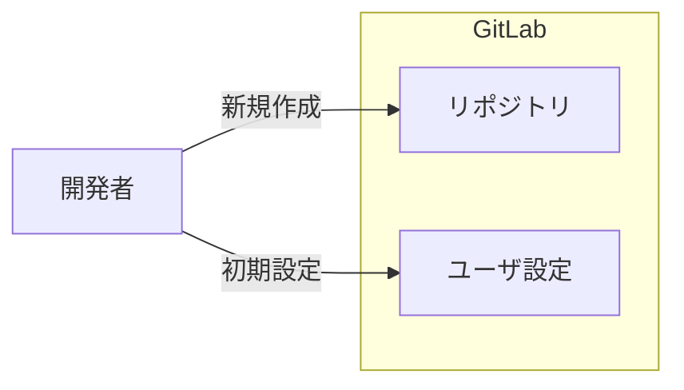
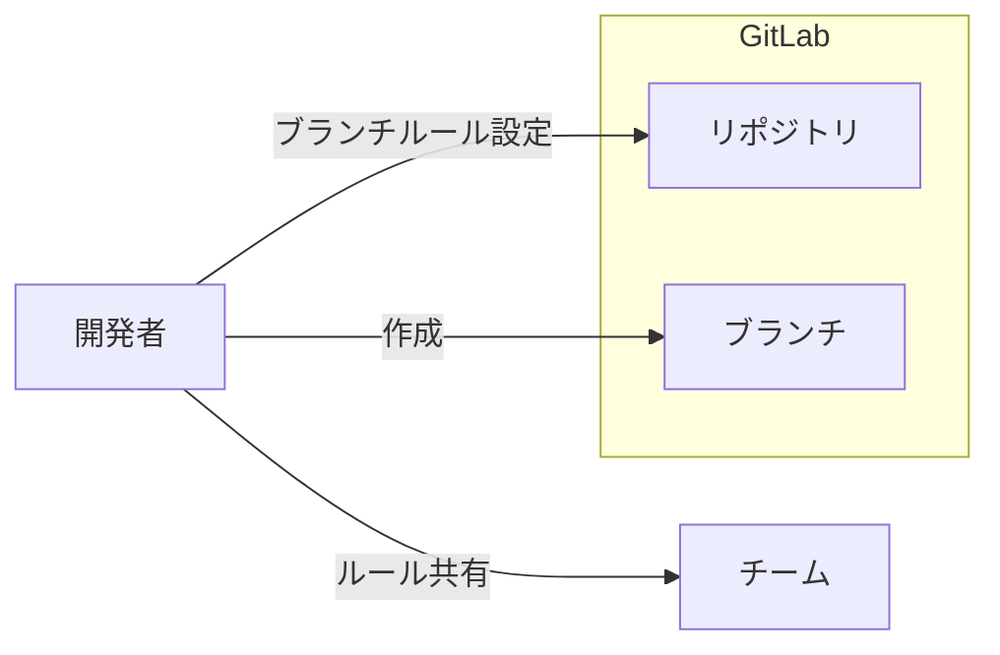
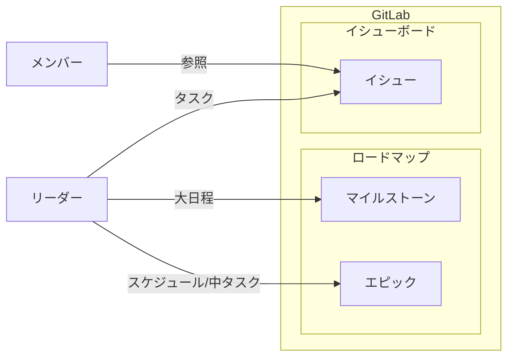
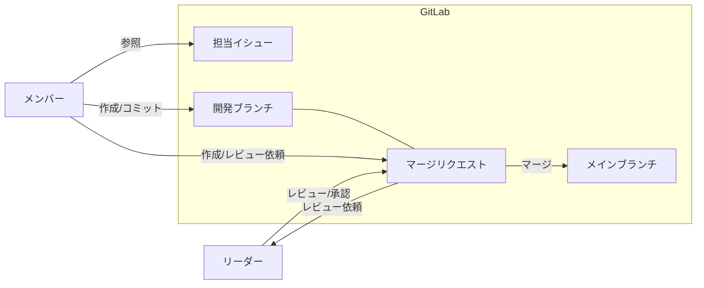
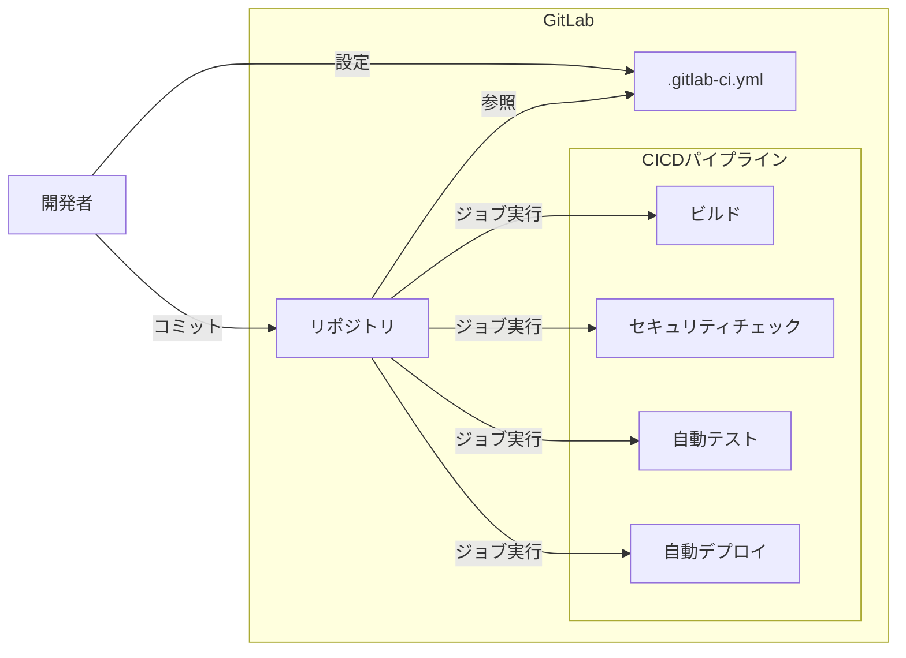
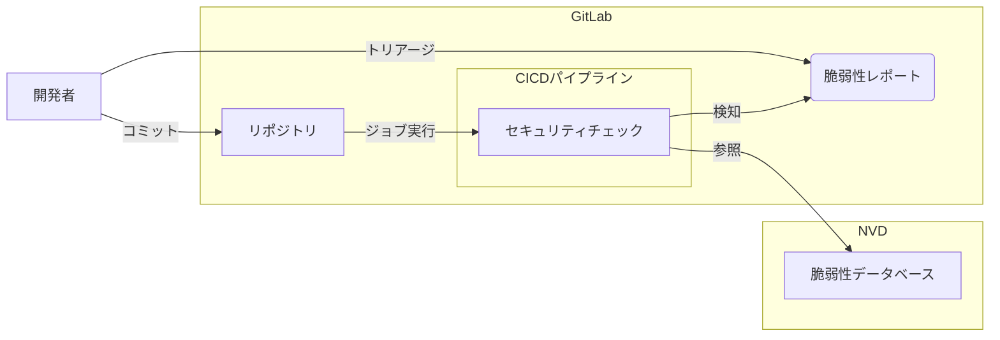
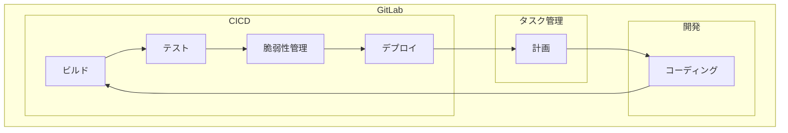

# GitLab開発ガイドライン

## 概要

本ガイドラインでは、GitLabでの開発を最初から全6ステップで説明する。

## 6つのステップ

1. リポジトリ作成と初期設定
1. ブランチフロー策定
1. タスク管理
1. 開発
1. CICDパイプライン構築
1. 脆弱性管理

import { Steps } from 'nextra/components'

<Steps>
### Step 1 リポジトリ作成と初期設定

GitLabにリポジトリを作成し、初期設定を実施する。

### Step 2 ブランチフロー策定

プロジェクトのブランチフローを決め、チーム内でルールを共有する。

### Step 3 タスク管理

リーダーはスケジュールをマイルストーン、エピックで作成し、タスクをイシュー化してメンバーに割当てる。

### Step 4 開発

メンバーは開発スタート時、担当イシューからブランチ・マージリクエストを作成し、実装後にレビュー依頼を送付する。

### Step 5 CICDパイプライン構築

CICDパイプラインを設定(.gitlab-ci.yml)し、コミット時にジョブを自動実行する。

### Step 6 脆弱性管理

CICDパイプラインのセキュリティチェックで検知した脆弱性をトリアージする。

</Steps>

## まとめ

以上が、GitLabを用いた開発の一連の流れとなる。

開発サイクル完成後は、Step3 タスク管理 ～ Step6 脆弱性管理をなるべく早く細かく循環させることでGitLabを用いたDevSecOpsが実現する。

