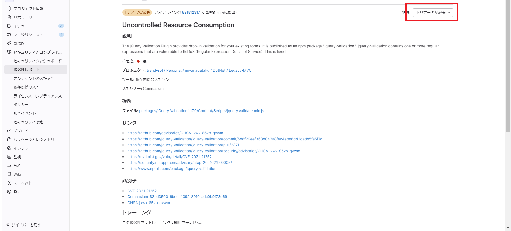

# GitLabでの脆弱性管理

## 概要

本稿では、CICDでのセキュリティチェック結果としてレポートに出力された脆弱性の取り扱い手順について説明する。

## 全体イメージ

各プロジェクトのCICDパイプラインでスキャンされた脆弱性は、脆弱性レポートとして集約管理される。トリアージによって、修正が必要と判断された場合は通常バグと同様に指摘箇所のソースコードを修正し、再度パイプラインを実行する。

※DependencyScanやセキュリティダッシュボードはUltimate版での提供。

## 脆弱性の検知

GitLabでは公開された脆弱性情報を参照し、日々更新されるデータベースとライブラリのバージョンを照合して脆弱性を検出する。

※出典 [NVD(NATIONAL VULNERABILITY DATABASE)](https://nvd.nist.gov/vuln/search/results?form_type=Basic&results_type=overview&search_type=all&isCpeNameSearch=false)

CICDパイプラインのセキュリティスキャン実行時、該当ソースコードに脆弱性が検知された場合はパイプラインで通知され、脆弱性レポートに自動登録される。

### 脆弱性情報のキーワード

脆弱性レポートに含まれる以下3つのキーワードを基に対応要否、緊急度を判断する。log4jの脆弱性を例に各キーワードを説明する。

#### CVE

##### 脆弱性の識別番号

例:
CVE-2021-44228: このIDはlog4jのJNDI Injection脆弱性を表す。この脆弱性を利用すると、リモートの攻撃者が任意のコードを実行できる可能性がある。

#### CWE

##### 脆弱性の分類番号

例:
CWE-20: 入力検証の不備。log4jの脆弱性は、不適切な入力検証に起因しており、攻撃者が悪意のある入力をすることでJNDIリクエストをトリガーできる。

#### CVSS

##### 脆弱性の重要度

例:
CVE-2021-44228のCVSSスコア:10.0 (致命的)

- 攻撃ベクトル (AV): ネットワーク
- 攻撃の複雑さ (AC): 低
- 認証 (PR): 不要
- ユーザの仲介 (UI): 不要
- スコープ (S): 変更あり
- 機密性 (C): 高
- 完全性 (I): 高
- 可用性 (A): 高

## 脆弱性のトリアージ

検出された脆弱性は、GitLabのメニュー「安全」>「脆弱性レポート」にて一覧表示される。セキュリティスキャンで機械的に検出された脆弱性情報の対応要否トリアージを実施する。

### トリアージのフロー

トリアージは以下のフローで実施する。

### トリアージの実施手順

#### 重要度別の一次切り分け

脆弱性重要度はCVSSと呼ばれる業界標準の指標で評価される。CVSSスコアは0から10の範囲で、数値が高いほど脆弱性の影響が大きい。重要度ごとのプロジェクト対応方針を設定し、即時対応する場合とリスクを許容する基準を選択する。

| CVSSスコア | 重要度 |                                                      一般的な対応方針例                                                      |
| ---------- | ------ | ---------------------------------------------------------------------------------------------------------------------------- |
| 10.0 - 9.0 | 致命的 | 致命的な脆弱性。緊急に対応が必要。即時にパッチを適用し、必要に応じてシステムやアプリケーションをオフラインにすることを検討。 |
| 8.9 - 7.0  | 高     | 高リスク。可能な限り迅速に修正を行い、パッチや回避方法適用を推奨。                                                           |
| 6.9 - 4.0  | 中     | 中程度のリスク。予定されたメンテナンスや次回のリリース時に修正することが推奨。                                     |
| 3.9 - 0.0  | 低     | 通常、脆弱性の影響が限定的。定期的なレビューと対応が推奨。                                                                   |

##### ※参考 重要度の件数と分布

以下表のとおり、過去10年で約15万件の脆弱性が登録されている。2022年は約2万5千件が登録され、年々増加傾向にある。

※出典 [CVE Details(2023年9月時点)](https://www.cvedetails.com/)

#### ステータスの変更

説明列のリンクをクリックして、詳細画面を表示する。

詳細情報を確認し、右上の選択肢にてトリアージを実施する。

GitLabでのトリアージのステータスは以下で管理される。

|      大分類      |      中分類      |        説明        |
| ---------------- | ---------------- | ------------------ |
| トリアージが必要 |                  | 初期ステータス     |
| 確認             |                  | トリアージ済要修正 |
| 解除             | 許容可能なリスク |                    |
|                  | 偽陽性           |                    |
|                  | 制御を緩和中     |                    |
|                  | テストで使用     |                    |
|                  | 該当しない       |                    |
| 解決             |                  | 該当コード修正済   |

トリアージを進めるにあたって、1つひとつ脆弱性の内容を把握するのは相当に工数が必要となるが、結局のところ脆弱性対応の基本は最新版ライブラリへのアップデートになる。脆弱性の数が多すぎる場合は、1件ずつ確認する前にまずライブラリを最新版までアップデートし、脆弱性が残っている部分だけを詳細確認すると効率的である。

#### 脆弱性の修正

ソースコードの修正が必要な場合、イシューを起票して担当者を設定する。

## 脆弱性の管理

### プロジェクト毎の管理

プロジェクトの脆弱性サマリーは「セキュリティダッシュボード」にて管理する。最初のセキュリティチェックで大量の脆弱性が報告されるため、全件のトリアージを実施する。後の運用ではライブラリの追加・変更なく脆弱性が報告されることは少ないため、最初のトリアージで未仕分け、未対応の脆弱性を0件とすることが運用定着のために重要となる。

### 全社管理

プロジェクトの上位グループでは傘下プロジェクトの脆弱性をまとめて表示できる。

理想的には、GitLabの全プロジェクトでセキュリティチェックを行い、脆弱性情報をトップグループにて集約管理することが望ましい。

トップグループのセキュリティダッシュボードにて全プロジェクトのセキュリティステータスを管理する。平常時は0件となるように各プロジェクトにて随時トリアージを実施するように監査・支援する体制が必要となる。

脆弱性発生時はどのプロジェクトにセキュリティリスクがあるのかを確認し、対応を実施する。

## 参考リンク

[GitLab Docs](https://docs.gitlab.com/ee/)

- [GitLab Security Dashboards and Security Center](https://docs.gitlab.com/ee/user/application_security/security_dashboard/)
- [Vulnerability Report](https://docs.gitlab.com/ee/user/application_security/vulnerability_report/)

[IPA](https://www.ipa.go.jp/index.html)

- [共通脆弱性評価システムCVSS概説](https://www.ipa.go.jp/security/vuln/scap/cvss.html)

[NIST](https://nvd.nist.gov/)

- [NATIONAL VULNERABILITY DATABASE](https://nvd.nist.gov/vuln/search/results?form_type=Basic&results_type=overview&search_type=all&isCpeNameSearch=false)

[CVE Details](https://www.cvedetails.com/)
