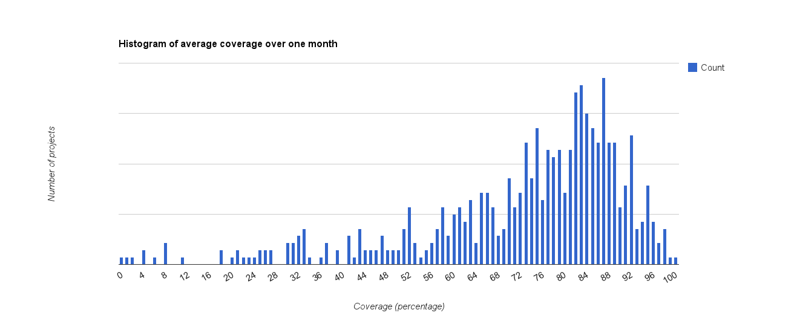
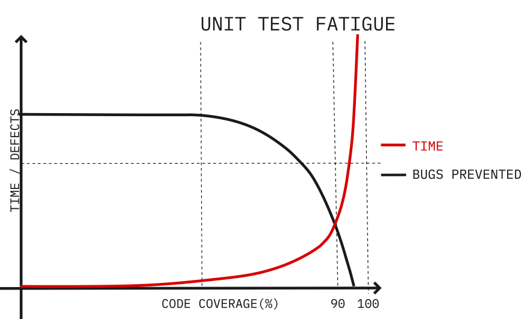

# テストカバレッジの考え方

## 概要

本稿では、テストカバレッジの概要と適切な使用方法について説明する。

テストカバレッジは品質管理の指標として、多くのプロジェクトで採用されている。CICDを構築して自動テストを実施して短サイクルの開発をする場合、都度手動で回帰テストを実施することは現実的でないため、テストコードとそのカバレッジを用いて品質を担保することが重要となる。

テストカバレッジは非常に有効な手法である一方、カバレッジ100％であってもバグがないことを保証するわけではない。十分に検討せずカバレッジ100％を必須としたために自動テスト作成やメンテナンスで開発者のリソースを食いつぶして全体の品質を損なったり、遅延原因となるプロジェクトもあるため、適切な使用が必要である。

## テストカバレッジとは

テストカバレッジは、自動テストプログラムによってソースコードのどの部分がテストされているかを測定する尺度で自動テストの網羅率を示す。テストカバレッジはパーセンテージで表され、テストカバレッジが 90％であれば、全コードの 90％が自動テストによって実行され、残りの 10％は自動テストがカバーしていない部分となる。

プロダクトオーナーは、新規コードのユニットテストコード作成をルール化、テストケースの過不足をチェックし、全体のカバレッジが適切な値で推移するようにマネジメントすることが求められる。

## カバレッジの種類

カバレッジは測定方法によって、以下のC0 ～ C2の3種類に分けられる。原則これらは正の相関関係にあり、C0が高ければC1,C2も高くなる。

| 指標 | カバレッジの種類         | 説明                                                                                            |
| ---- | ------------------------ | ----------------------------------------------------------------------------------------------- |
| C0   | ステートメントカバレッジ | プログラムの各ステートメントが少なくとも一度は実行されたかどうかを測定する。                    |
| C1   | ブランチカバレッジ       | プログラムの各分岐（if/else 文など）が少なくとも一度は実行されたかどうかを測定する。            |
| C2   | 条件カバレッジ           | 各論理的な条件（AND/OR 条件など）が真と偽の両方で少なくとも一度は評価されたかどうかを測定する。 |

### C0(ステートメントカバレッジ)の例

#### 実装コード（C0）

```python
def add(a, b):
    c = a + b  # このステートメントが実行されることをチェック
    return c # このステートメントが実行されることをチェック
```

#### テストコード（C0）

```python
def test_add_positive_nums():
    assert add(1, 2) == 3

def test_add_negative_nums():
    assert add(-1, -2) == -3

def test_add_pos_and_neg_nums():
    assert add(1, -2) == -1
```

### C1(ブランチカバレッジ)の例

#### 実装コード（C1）

```python
def is_even(n):
    if n % 2 == 0:
        return True  # このブランチが実行されることをチェック
    else:
        return False  # このブランチも実行されることをチェック
```

#### テストコード（C1）

```python
def test_is_even_true():
    assert is_even(2) == True

def test_is_even_false():
    assert is_even(3) == False
```

### C2(条件カバレッジ)の例

#### 実装コード（C2）

```python
def is_adult_and_has_license(age, has_license):
    if age >= 18 and has_license:  # ここのAND条件が真と偽の両方で評価されることをチェック
        return True
    else:
        return False
```

#### テストコード（C2）

```python
def test_is_adult_and_has_license_true():
    assert is_adult_and_has_license(20, True) == True

def test_is_not_adult_but_has_license_false():
    assert is_adult_and_has_license(16, True) == False

def test_is_adult_but_has_no_license_false():
    assert is_adult_and_has_license(20, False) == False

def test_is_not_adult_and_has_no_license_false():
    assert is_adult_and_has_license(16, False) == False
```

特に指定がない場合、カバレッジは C0 を指す。通常のプロダクトでは C0 をベースとして C1 までを指標として利用すれば必要十分で、C2 を指標に含める場合はコストパフォーマンスを考慮する必要がある。

## 適切なカバレッジの基準値

一般にカバレッジの基準値は 60 ～ 90％が許容範囲で 85％前後が最適値とされている。範囲内でどのレベルのカバレッジを実現するかはプロダクトの用途や使用言語によって様々である。また、カバレッジの高さは必ずしも品質を保証するものではないため、幅を持って捉え特定数値を必達のテスト完了条件とする必要はない。

### Googleの基準

Googleのガイドラインを例にあげると以下を基準としている。

- 60％ : 許容範囲
- 75％ : 推奨
- 90％ : 模範的

Googleプロダクト別のテストカバレッジ(n=650)



※出典 [Google Testing Blog](https://testing.googleblog.com/2014/07/measuring-coverage-at-google.html)

ヒストグラムから、以下がわかる。

- 中央値は 78％、最頻値は 87％
- 75 パーセンタイルは 85％、90 パーセンタイルは 90％
- テストカバレッジが 90％以上のプロダクトは 10％しかない
- テストカバレッジが 100％のプロダクトはほぼない

各プロダクトのカバレッジがバラバラとなってることは、カバレッジはプロダクト状況・特性によって変化するもので、厳密な統一基準を設定できない事を示している。

### テストカバレッジ100パーセントを基準にしてはいけない理由

テストカバレッジ100％が開発の弊害となることは、アジャイルマニフェストの共同署名者の1人マーティン・ファウラー氏の以下の説明が的を得ている。

> プログラミングの多くの側面と同じく、テストには思慮深さが必要だ。よいテストを選るのに、TDD は有用だが、決して十分ではない。思慮深くテストを実施すれば、テストカバレッジはおそらく80%台後半か90%台になるだろう。100%は信用ならない。カバレッジの数字ばっかり気にして、自分が何をやっているかわかっていない人間のいる臭いがする。
> カバレッジの数値がほしい理由はわかる。テストが十分かを知りたいのだ。カバレッジの数値が低い場合、たとえば 50%以下の場合は、おそらく問題があるだろう。けれど高いカバレッジの数値にはあまり意味はない。ダッシュボードの数字に意味がなくなる助けをするだけだ。

※引用 [Martin Fowler's Bliki (ja) テストカバレッジ](https://bliki-ja.github.io/TestCoverage)

C0/C1 のテストカバレッジ 100％を品質基準としているプロジェクトは、以下3つの点で再検討の余地がある。

#### 全てのコードが実行されるわけではない

理想的には実行されるコードのみが記載されるべきだが、現実のコードには以下のように実行されないコードが含まれる。

- 仕様変更によって使用されなくなったコード
- 一時的に他ライブラリのバグを回避するコード
- テストや障害時の調査用に仕込まれたコード
- パターンとして存在しないが、念のため作成したコード
- 他プロジェクトや Web からコピーしてきて、一部のメソッドしか使用されないコード
- DB レイアウトや API 仕様が決まる前に作成した null チェックなどのコード

これらのコードは適宜リファクタリングするのが本来の姿だが、使用されていないことを明らかにするには全参照箇所の調査とテストが必要なため、特に内製でない大規模プロジェクトでは削除されないことが多い。

実行されないコードに対して、テストコードは不要である。

#### コストパフォーマンス

ユニットテストの作成コストはカバレッジが100％に近づくにつれて非線形に増加し、検出されるバグの数は減少する。90％を100％に上げる努力は多くの場合工数と効果が見合わず、最後は1行のコードをテストするために数十行のテストコードを書くことになる。結果、作り込まれて柔軟性を失い、実装コードと密結合なテストコードはメンテナンスが必要な技術負債として、将来に渡ってプロジェクトを圧迫する要因となる。



※出典 [The price of software: Unit testing](https://dev.to/bogdanned/the-price-of-software-unit-testing-59i9)

上記の実行されないコードに加えて、以下のような自動テストが難しいパターンは無理矢理テストコードを作成するようなアプローチはとる必要がなく、手動テストで実施することを検討する。

- UI/UX の処理
- 設定ファイルの動的変更が必要となる処理
- ロールバックや排他制御などミドルウェアに依存する処理
- サーバに接続できない、API から応答がないなどプリミティブなエラーハンドル処理
- その他 Mock 利用時に実現が難しい処理など

#### 100％にすることが自体が目的となる

一見真っ当で客観的な指標に見えるカバレッジテスト100％を必達とすると、開発者は手段を選ばず100％を数字として報告する必要がある。結果、バグをOKとするようなテスト作成、実行されないパターンの意味のないテスト作成、カプセル化されたメソッドのスコープを変更するなど、本末転倒な対策を開発者は強いられることになる。

このような不毛な対応にリソースを取られた結果、重点的にテストすべき機能ごとの優先順位づけなど、カバレッジでは表現されないが本来行われるべき品質向上の施策にリソースが配分されなくなる悪循環に陥る。

上述の[C2(条件カバレッジ)の例](#c2条件カバレッジの例)で考えると、C0,C1,C2カバレッジはいずれも100％となるが、境界値テストパターンであるage=17と18のケースが含まれていない。このケースはカバレッジを数パーセントあげるよりも重要だが、カバレッジ数値を上げるための他ケースを作成することにリソースが割かれるため、実施されなくなる。

また、このメソッドが日に1回しか実行されない場合と日に1万回実行される場合や、画面表示で使用される場合と決済処理で使用される場合は、それぞれ求められる品質とテストケースは違う。カバレッジではテストケースの過不足は網羅率のみ1次元的にしか評価されないため、機能の特性は考慮されていない。このように分かりやすい数値にのみ注視して、重み付けといった潜在的な要素を軽視すると、却ってテスト全体の質の低下を招くことになる。

カバレッジ100％の聞こえは良いが、結局のところ全てのコードを1回実行した結果エラーにならなかったことを示しているだけで、何の保証にもならない。カバレッジは多元的なテスト品質を測る1つの指標でしかなく、それだけを厳密に管理して100％を達成・維持することは手間がかかるだけで意味がない。

## まとめ

テストカバレッジは有効な指標であるが、それだけで品質を担保できない。これから自動テストのカバレッジを導入する場合、まず 60％のカバレッジを目標としながら段階的に導入し、プロジェクトの特性とフィッティングを重ねて概ね 80％台となる形が望ましい。特定の数値を基準とする場合でも、幅をもったレンジで運用することが重要である。

もっとも効果的なテストは、ユニットテスト、結合テスト、システムテストを自動・手動を交えて実施する事に変わりはない。カバレッジの数値だけを追求するのではなく各テストに開発リソースを適切に配分することが、結果的に開発速度を保ちながら全体の品質を高めることに繋がる。

## 参考リンク

- [テストカバレッジ 100%を追求しても品質は高くならない理由と推奨されるカバレッジの目標値について](https://qiita.com/odekekepeanuts/items/d02eb38e790b93f44728)
- [Measuring Coverage at Google](https://testing.googleblog.com/2014/07/measuring-coverage-at-google.html)
- [Code Coverage Best Practices](https://testing.googleblog.com/2020/08/code-coverage-best-practices.html)
- [テストカバレッジ](https://bliki-ja.github.io/TestCoverage/)
- [The price of software: Unit testing](https://dev.to/bogdanned/the-price-of-software-unit-testing-59i9)
